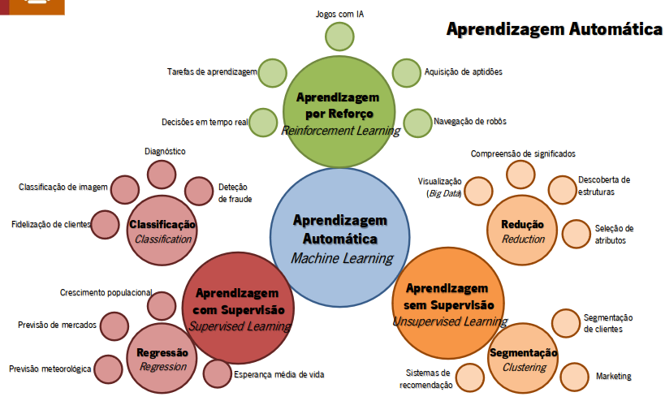

# Aprendizagem

## Inteligência Artificial

A abortagem da Inteligencia Artificial á representação de conhecimento expõe-se atraves de dois paradigmas:
 - Simbolico
   - Baseia-se na lógica para representar conhceimento;
   - Fundamentar o raciocinio na construção de sistemas de inferencia; 
 - Não Simbolico, sub-simbolico ou conexionista
   - Baseia o funcionamento do sistema na capacidade de aprender, generalizando;
   - Resolve problemas com base em conhecimento passado ou dados sobre a resolução de outros problemas;

## Big Data

_Big Data_ é um termo popularizado para se referir a dados em grandes quantidades e complexidade para serem tratados por abordagem tradicionais de computação. O _Big Data_ é caracterizado por 3 Vs:
 - Volume
 - Velocidade
 - Variedade

## Machine Learning

### Aprendizagem Automática

Paradigma de computação em que a carateristica essencial do sistema se revela pela sua capacidade de aprender de modo autonomo e independente;

Caracteristicas diferenciadora dos algoritmos de Machine Learning são algoritmos _data-driven_:
 - Um hipotético algoritmo aprenderia o que é uma mesa pela definição algoritmica da configuração de uma mesa;
 - Um algoritmo de Machine Learning aprende sem necessidade de que seja codificada a solução do problema;
 - Um algoritmo de Machine Learning aprende a partir de diversos exemplos de cadeiras, aprendendo a dizer se um determinado objeto é ou não é uma cadeira;

### Aprendizagem Supervisionada

Paradigma da aprendizagem em que os casos que se usam para aprender contêm informação acerca dos resultados pretendidos, sendo possivel estabelecer uma relação entre os valores produzidos pelo sistema;

 - A grande maioria dos algoritmos de ML usa aprendizagem com supervisão;
 - Aprendizazgem supervisionada significa que os dados de entrada (X) e os resutantes (Y), tornam possivel que o algoritmo aprenda uma função (f) de mapeamento dos dados nos resultados: y = f(x);
 - Diz-se supervisionada porque este mapeamento é acompanhado por um "professor/treinador" que supervisiona o processo de aprendizagem;
 - Normalmente, são divididos em duas categorias:
   - **Classificação** : quando os resultantes são discretos;
   - **Regressão** : quando os resultados são continuos;

### Aprendizagem Não Supervisionada

Paradigma de aprendizagem em que não são conhecidos resultados sobre os casos, apenas os enunciados dos problemas, tornando necessário a escolha de técnicas de aprendizagem que avaliem o funcionamento interno do sistema;

 - A aprendizagem não supervisionada significa que existem dados de entrada (x) mas não existem os correspondentes resultados;
 - O objetivo deste tipo de aprendizagem é o de modelar a estrutura ou a distribuição dos dados do problema;
 - Normalmente, são divididos em duas categorias:
   - **Segmentação** : quando o objetivo é dividir os dados em grupos;
   - **Associação** : quando o objetivo é encontrar regras que descrevam as relações entre os dados;

### Aprendizagem por Reforço

Paradigma de aprendizagem que, apesar de não ter informação sobre os resultados pretendidos, permite efetuar uma avaliação sobre se os resultados produzidos são bons ou maus;

 - Algoritmos de Reinforcement Learning usam técnicas de auto-alimentação de sinais, com vista a melhorar os resultados, por influência da noção de recompensa/penalização;
 - Não se pode comparar com Aprendizagem Supervisionada uma vez que a “opinião” sobre os resultados não é dada por um professor/treinador;
 - Também não se pode considerar Aprendizagem não Supervisionada, uma vez que não existe ausência absoluta de informação sobre os resultados;
 - A aprendizagem dá-se pela capacidade de crítica sobre os próprios resultados produzidos pelo algoritmo;
   - **Q-learning** : assume que esta a seguir uma politica otima e usa-a para atualização dos valores das ações;
   - **SARSA** : considera a politica de controlo que esta a ser seguida e atualiza o valor das ações;
